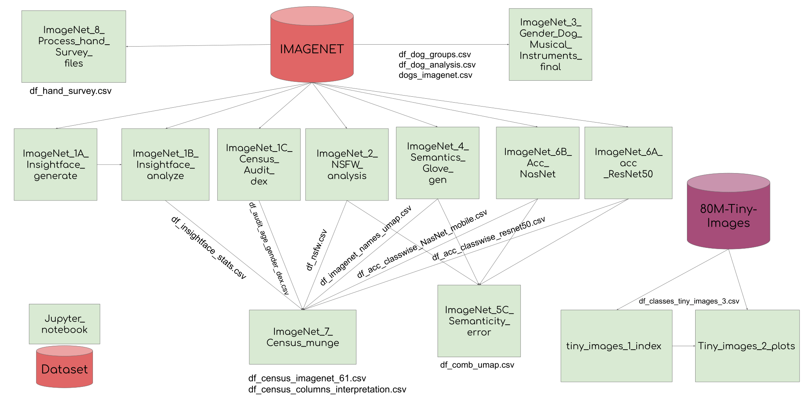

# Goal
The goal of the repository is to host all the code and community data assets we have curated during the execution of our project titled _Large datasets: A Pyrrhic win for computer vision?_

#### Table of Contents
- Tour of all the census CSV file generated [Tour_csv](Notebooks/Tour_csv.ipynb)
([nbviewer](https://nbviewer.jupyter.org/github/vinayprabhu/Dataset_audits/blob/master/Notebooks/Tour_csv.ipynb))

- InsightFace generate: [ImageNet_1A_Insightface_generate](Notebooks/ImageNet_1A_Insightface_generate.ipynb) 
([nbviewer](https://nbviewer.jupyter.org/github/vinayprabhu/Dataset_audits/blob/master/Notebooks/ImageNet_1A_Insightface_generate.ipynb))
- InsightFace analysis: [ImageNet_1B_Insightface_analyze](Notebooks/ImageNet_1B_Insightface_analyze.ipynb)
([nbviewer](https://nbviewer.jupyter.org/github/vinayprabhu/Dataset_audits/blob/master/Notebooks/ImageNet_1B_Insightface_analyze.ipynb))
- Dex Audit generate: [ImageNet_1C_census_audit_dex](Notebooks/ImageNet_1C_census_audit_dex.ipynb)
([nbviewer](https://nbviewer.jupyter.org/github/vinayprabhu/Dataset_audits/blob/master/Notebooks/ImageNet_1C_census_audit_dex.ipynb))
- NSFW analysis: [ImageNet_2_NSFW_analysis](Notebooks/ImageNet_2_NSFW_analysis.ipynb)
([nbviewer](https://nbviewer.jupyter.org/github/vinayprabhu/Dataset_audits/blob/master/Notebooks/ImageNet_2_NSFW_analysis.ipynb))
- Co-occurence bias analysis (Dog ownership and musical instruments): [ImageNet_3_Gender_Dog_musical_instruments_final](Notebooks/ImageNet_3_Gender_Dog_musical_instruments_final.ipynb)
([nbviewer](https://nbviewer.jupyter.org/github/vinayprabhu/Dataset_audits/blob/master/Notebooks/ImageNet_3_Gender_Dog_musical_instruments_final.ipynb))
- Glove embeddings generated: [ImageNet_4_Semantics_glove_gen](Notebooks/ImageNet_4_Semantics_glove_gen.ipynb)
([nbviewer](https://nbviewer.jupyter.org/github/vinayprabhu/Dataset_audits/blob/master/Notebooks/ImageNet_4_Semantics_glove_gen.ipynb))
- Semanticity error NSFEW analysis: [ImageNet_5C_Semanticity_error](Notebooks/ImageNet_5C_Semanticity_error.ipynb)
([nbviewer](https://nbviewer.jupyter.org/github/vinayprabhu/Dataset_audits/blob/master/Notebooks/ImageNet_5C_Semanticity_error.ipynb))
- ResnET 50 Accuracies: [ImageNet_6A_acc_ResNet50](Notebooks/ImageNet_6A_acc_ResNet50.ipynb)
([nbviewer](https://nbviewer.jupyter.org/github/vinayprabhu/Dataset_audits/blob/master/Notebooks/ImageNet_6A_acc_ResNet50.ipynb))
- NasNet accuracies: [ImageNet_6B_acc_NasNet](Notebooks/ImageNet_6B_acc_NasNet.ipynb)
([nbviewer](https://nbviewer.jupyter.org/github/vinayprabhu/Dataset_audits/blob/master/Notebooks/ImageNet_6B_acc_NasNet.ipynb))
- Coalescing all the results to form a monolithic census dataframe: [ImageNet_7_Census_munge](Notebooks/ImageNet_7_Census_munge.ipynb)
([nbviewer](https://nbviewer.jupyter.org/github/vinayprabhu/Dataset_audits/blob/master/Notebooks/ImageNet_7_Census_munge.ipynb))
- Hand survey images (61 images in the ImageNet dataset): [ImageNet_8_Process_hand_survey_files](Notebooks/ImageNet_8_Process_hand_survey_files.ipynb)
([nbviewer](https://nbviewer.jupyter.org/github/vinayprabhu/Dataset_audits/blob/master/Notebooks/ImageNet_8_Process_hand_survey_files.ipynb))
- Tiny Images index analysis : [tiny_images_1_index](Notebooks/tiny_images_1_index.ipynb)
([nbviewer](https://nbviewer.jupyter.org/github/vinayprabhu/Dataset_audits/blob/master/Notebooks/tiny_images_1_index.ipynb))
- Tiny images visualizations ( *Racial epithets presence warning!*) : [tiny_images_2_plots](Notebooks/tiny_images_2_plots.ipynb)
([nbviewer](https://nbviewer.jupyter.org/github/vinayprabhu/Dataset_audits/blob/master/Notebooks/tiny_images_2_plots.ipynb))
